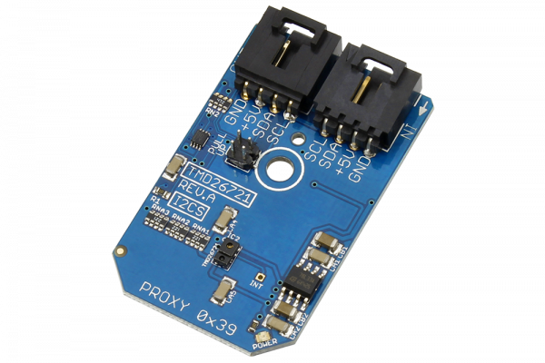

[](https://store.ncd.io/product/tmd26721-infrared-digital-proximity-detector-i2c-mini-module/).

#  TMD26721

The TMD26721is an infrared digital proximity detector.This device includes improved features, such as signal-to-noise frequency and accuracy. To prevent false proximity data measurement, the TMD26721 proximity saturation indicator bit signals that the internal analog circuitry has reached saturation.
This Device is available from www.ncd.io 

[SKU: TMD26721]

(https://store.ncd.io/product/tmd26721-infrared-digital-proximity-detector-i2c-mini-module/)
This Sample code can be used with Raspberry Pi.

Hardware needed to interface TMD26721 infrared digital proximity detector sensor With Raspberry Pi :
1. <a href="https://store.ncd.io/product/tmd26721-infrared-digital-proximity-detector-i2c-mini-module/">TMD26721 infrared digital proximity detector sensor</a>
2.  <a href="https://store.ncd.io/product/i2c-shield-for-raspberry-pi-3-pi2-with-outward-facing-i2c-port-terminates-over-hdmi-port/">Raspberry Pi I2C Shield</a>
3. <a href="https://store.ncd.io/product/i%C2%B2c-cable/">I2C Cable</a>

## Python
Download and install smbus library on Raspberry pi. Steps to install smbus are provided at:

https://pypi.python.org/pypi/smbus-cffi/0.5.1

Download (or git pull) the code in pi. Run the program.

```cpp
$> python TMD26721.py
```
The lib is a sample library, you will need to calibrate the sensor according to your application requirement.
